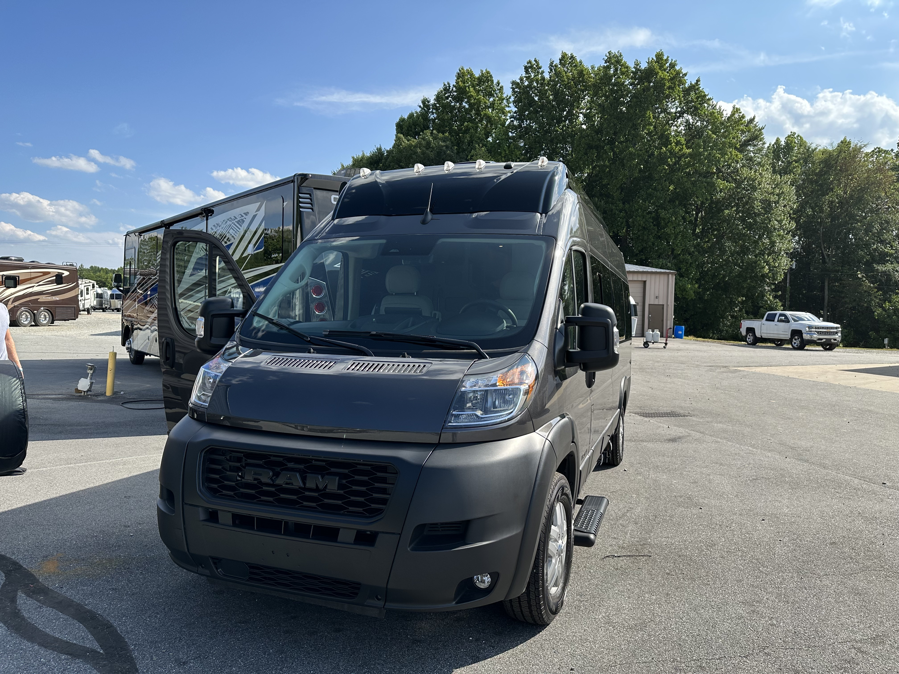

- Flew to CLT to Uber to GSO to pick up [[Vandy Patinkin]] from [[Airstream of Greensboro]]
- Ubered to [[Airstream of Greensboro]]
	- First Uber ride ever, it was great. Although the vehicle had a bit of an unbalanced-wheel-feel at freeway speeds and I think one of the right turn signal bulbs was burned out.
- [[Vandy Patinkin]] at [[Airstream of Greensboro]]
	-  #photo
	-  #photo
- The tech at [[Airstream of Greensboro]] walked me through the whole coach.
- Running my own ((fc1c326f-8eb4-4d21-9a02-a815328c22d5)), I found that the [[generator]] wouldn't stay running. #problem
	- The techs first thought it was the heat on the pavement.
	- Then they thought it was low fuel in the tank.
	- Finally they said the breaker was bad and it would have to be serviced at [[Cummins]].
	- I went on my way without a functional [[generator]].
- ((649f3602-4d63-4676-b468-3a3b0ef7a6fe))
	- DOING ordering new back door flap and cover for sliding door via [[Airstream of Greensboro]] #incoming
- Stopped at [Moo & Brew](https://mooandbrew.com/) in Charlotte on the way to Clemson.
	- Good burger. Called "The Farmer's Daughter."