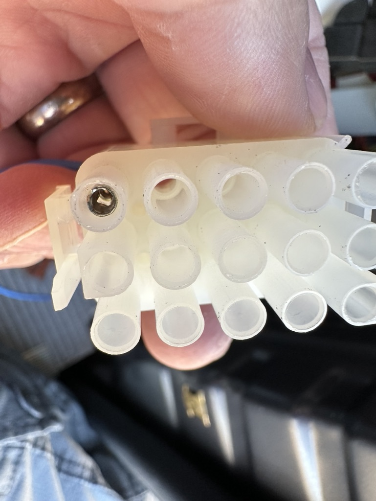
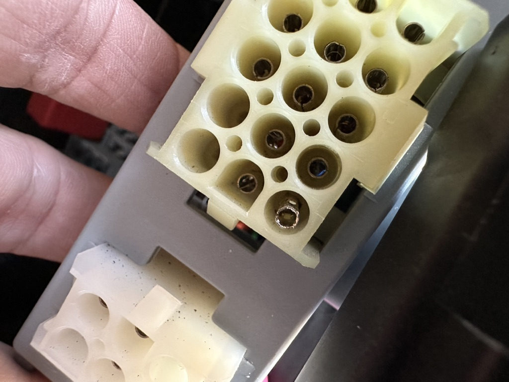

- B-pillar upfitter accessory connector
	- [[Stellantis]] calls this the  #manual
	- {:height 874, :width 650} #photo
	-  #photo
- DONE Ordered correct B-pillar connector #incoming
  id:: 649f3602-df3f-4a27-a705-0283d7cde6f6
	- ((64a826fd-cfac-47b9-84fd-0d6a63371da3))
	- B-pillar [350218-1 connector](https://www.te.com/usa-en/product-350218-1.html) from TE
	  id:: 649f3602-54ad-41e6-b171-3529d5727a8b
		- Free shipping to the U.S.
		- They will ship just one!
	-
	-