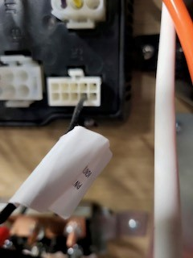
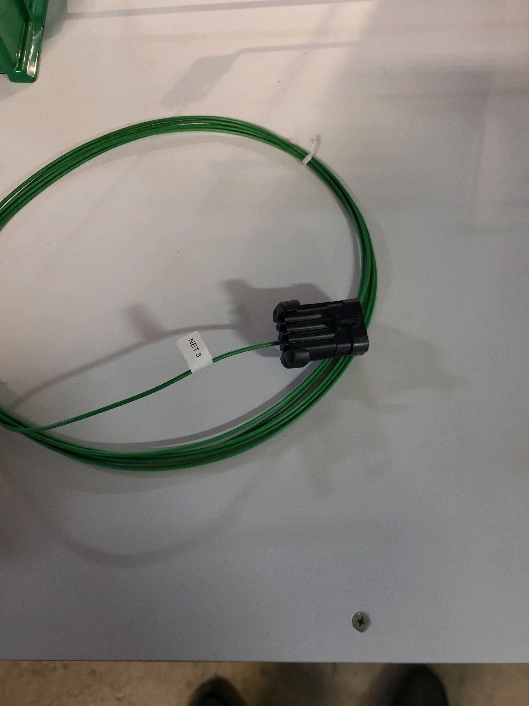

- TODO Reset [[house battery]] SOC:
	- > We may need to reset your SOC. This will consist of running the the battery down to 11V. Once the battery is down, plug the unit into shore to charge back up. Once the charge rate from bulk to absorb charge, unplug it, kill ht power and let the unit sit for 10 minutes. Once you turn the unit back on the SOC should be reset.
- [[Generator]] fault codes:
	- FC45
	- FC32
	- speed sense lost and crank under speed
- Wake wire:
	-  #photo from [[Airstream]]
	-  #photo from [[Airstream]]
		-
- Sent support request to [[Firefly]] via their [website](https://www.fireflyint.com/contact-tech-support).
- [[Airstream]]'s fix for engine not charging [[house battery]] :
	- [Rangeline Engine not Charging House Batteries. Ignition wire has No Power. .docx](../assets/Rangeline_Engine_not_Charging_House_Batteries._Ignition_wire_has_No_Power._1687983567450_0.docx)
		-