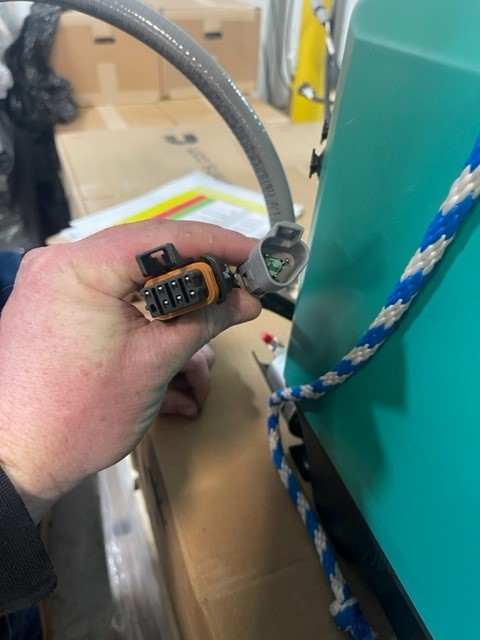

- generator interface plugs
	-  #photo from [[Airstream]]
- DONE Order sheets from [Mattress Insider](https://www.mattressinsider.com/) #incoming
  SCHEDULED: <2023-06-28 Wed>
  :LOGBOOK:
  CLOCK: [2023-06-28 Wed 15:25:11]
  :END:
	- ((649c558b-e52e-4e05-a35f-68b7ecf8d493))
	- bed sizes as measured #specification
		- 53" x 74" x 3" -- ordering 53 x 74 x (3+4)
		- 51" x 79.5" x 2" -- ordering 51 x 79.5 x (2+4)
	- [[Mattress Insider/Nathan]] was very thorough on the phone taking the order. He recommended we order sheets to the size that we measured, *not* the size Airstream specifies on their website.
	- May order custom-size memory foam mattresses from him in the future, depending on how (un)comfortable the OEM mattresses are.
- [[Firefly/Melvin]] called me back and helped me troubleshoot the issue with the [[generator]] not staying running: #problem
	- Ultimately the generator continues to run when disconnected from the [[Firefly]] system.
	- The touchscreen contains the bluetooth chip that connects to the wireless remote controls. Without the touchscreen connected to the system, the [[Vera]] smartphone app is necessary to control the system.
-