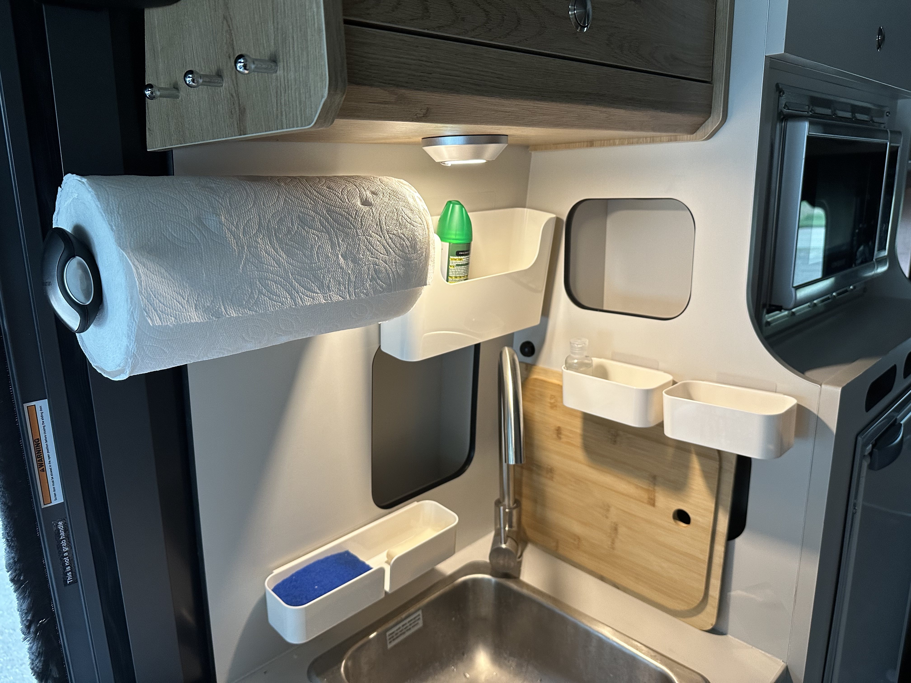

- Putting in another order for some gear from [[Amazon]]
  SCHEDULED: <2023-07-11 Tue>
	- DONE Package 1 #incoming
	  id:: 64a979ed-350a-406a-b63c-f0adcf78d064
	  SCHEDULED: <2023-07-11 Tue>
		- [Folding broom](https://www.amazon.com/dp/B000EDUUG2/ref=nosim?tag=ffwf05-20) #equipment
			- The obligatory folding broom and dustpan
		- [10-piece Rubbermaid food storage set](https://www.amazon.com/dp/B08145FFWG/ref=nosim?tag=ffwf05-20) #equipment #storage
			- I'm hopeful these will fit in the pantry cabinet next to the [[bath]] .
	- DONE Package 2 #incoming
	  SCHEDULED: <2023-07-11 Tue>
		- [5-piece rope basket set](https://www.amazon.com/dp/B09VTFYLTJ/ref=nosim?tag=ffwf05-20) and [3-piece rope basket set](https://www.amazon.com/dp/B08NXXY7KV/ref=nosim?tag=ffwf05-20) #equipment #storage
			- Trying these out to see if they fit in the overhead cabinets.
			- It's important to have soft-sided storage when things may not just quite fit. Also they're probably quieter going down the road.
		- [Double wall mount shower pump](https://www.amazon.com/dp/B002YNQXMU/ref=nosim?tag=ffwf05-20) #equipment #storage #upgrade
		  id:: 64a97c9d-a3de-4516-8849-6f4110968ea6
			- The ((649f3602-1bd2-4e6d-90d2-059cd911883d)) would have fit on the wall behind the shower door, but it's hefty (well-built) and the shower wall seems a bit flimsy in that area, so I'm going to swap it for a double and put it under the mirror on the wall behind the toilet.
- Until I can work out a vertical tension arm for the ((64a3070b-33ff-4bb0-b019-bddcfd926dc0)), I will be mounting it horizontally. Yes, it will stick out into the key hook hanging area, but hook \#3 still has enough clearance to hang a small ((649f3602-0835-453a-8348-cb89f537519b)) on it.
	- We ordered the 10" x 14" size in the "Aquamarine" and "Vivid Coral" colors.
		- How is a "face" towel smaller than a "hand" size towel?
	-  #photo #galley
		- Also check out the ((649f3602-9e18-4533-a20d-22ebd807ae90))
- [Box for Timberline fuel pump](https://www.amazon.com/dp/B075X14D5Z/ref=nosim?tag=ffwf05-20) #equipment #upgrade
	- As per [this Facebook post](https://www.facebook.com/groups/399267275508711/posts/541588447943259/), it should help with the noise of the heater fuel pump.
	- TODO I may try some rubber bushings first.