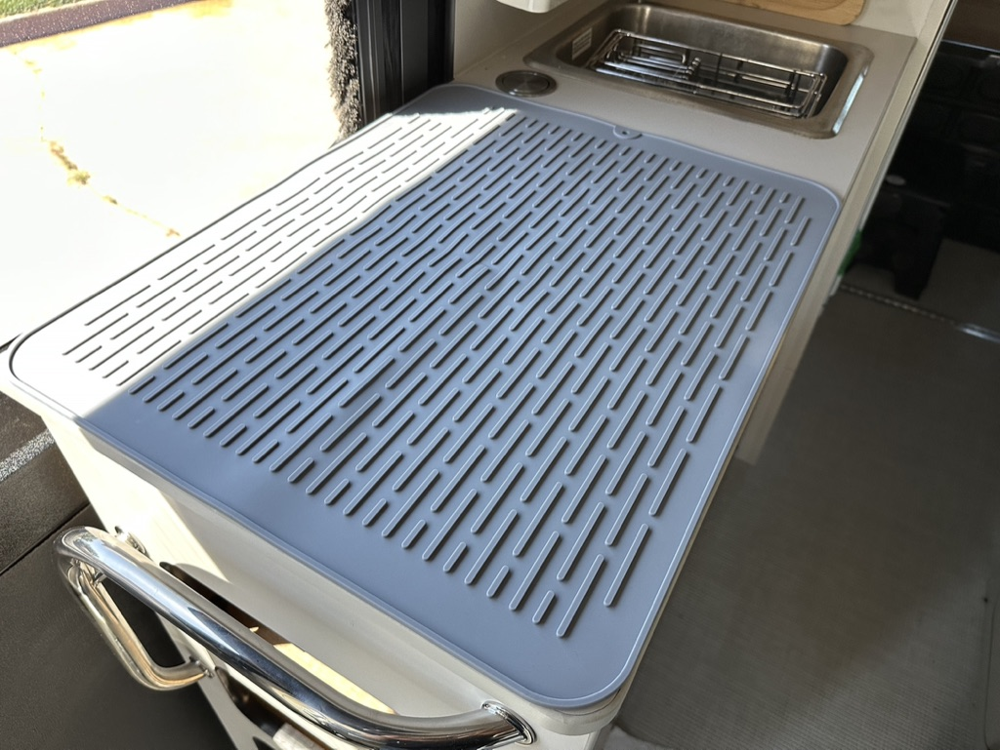
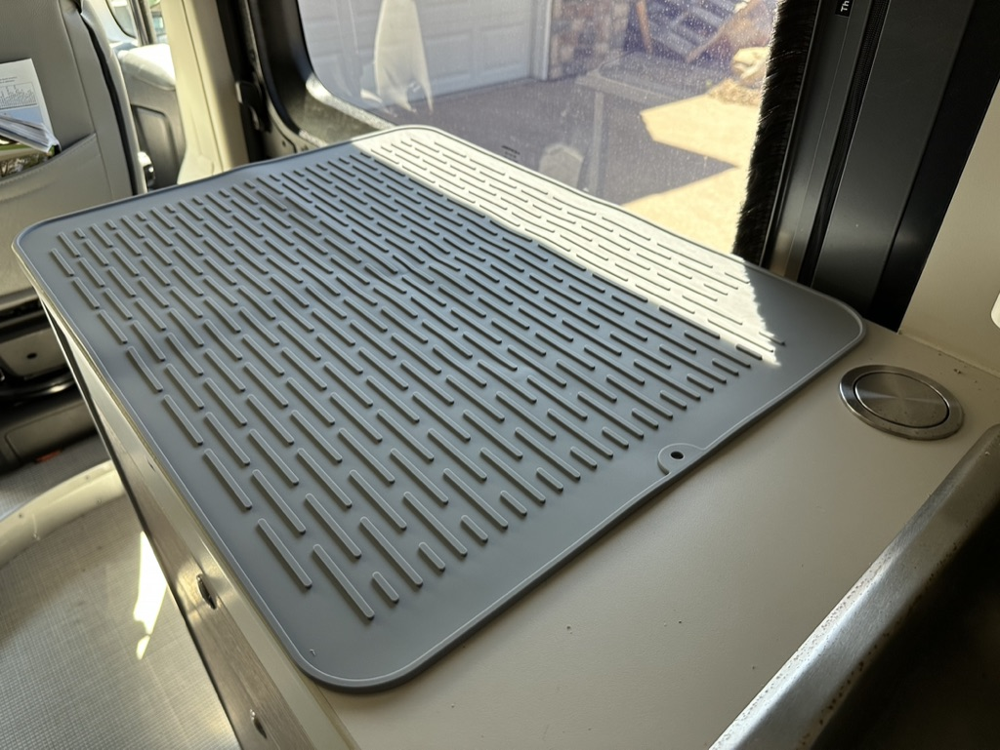
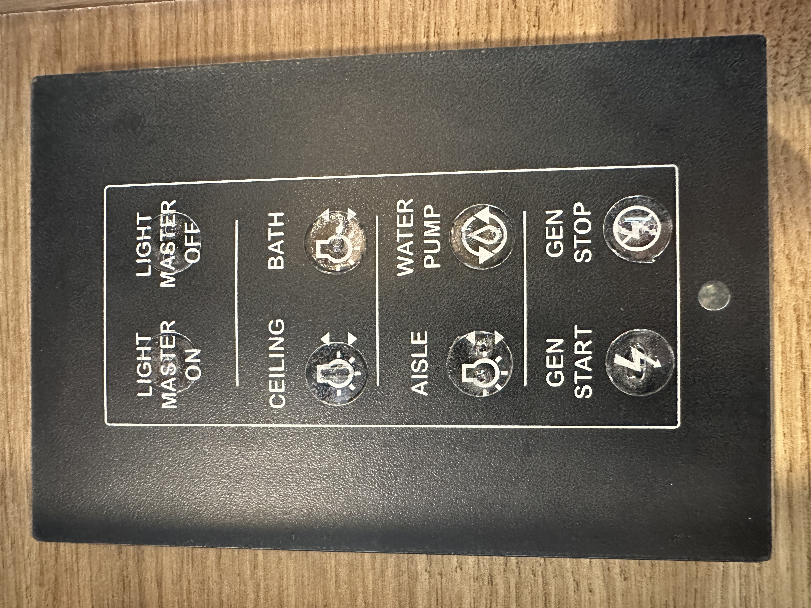

- The ((649f3602-f7dd-4a7a-90b3-b59749a4e8f9)) makes pretty good fried eggs. 🙂 Or maybe I do and the skillet is a decent tool.
	- I personally do not find the handle too sharp, but I can see how some others might.
	- The care instructions are pretty much like how you'd treat a cast iron skillet
		- No abrasives
		- No dishwasher
		- Don't soak
		- Clean gently with sponge
		- Dry immediately
- Here is a helpful video to fix the issue of the house battery not charging when the engine is on
  id:: 64a822fd-1709-4b5d-9c2c-6d05605e3d19
	- {{video https://www.youtube.com/watch?v=mmpBsELaT60}} #video
	- I only have one bit of information to add: make sure there is a tight physical connection between the wires. Electrical tape will not hold over time (even though I also used it as a *temporary* fix). I would personally *not* use the "jumper" method as shown in the video for a permanent solution, only as a hotwired kludge until you can get the appropriate part. If the connection comes loose over time there is a slight possibility of things sparking, melting, or catching fire.
		- Order a factory-specified male connector for the wire and put that in place:
			- ((64a826fd-cfac-47b9-84fd-0d6a63371da3))
			- Order a ((649f3602-54ad-41e6-b171-3529d5727a8b)) for the B-pillar.
				- They will ship you as few as one. I ordered three for $0.25 (total) and they were shipped free (in the U.S.). Yes, that's right, twenty-five cents.
		- The trick was getting the female connector out of the socket. I ended up cutting the wire and just kinda yanking it out with some very narrow pliers. Fortunately I did not damage the "mating connector" (big white nylon block that plugs into the other one).
		- I do have a wire cutter/stripper that I used to crimp the wire into the new connector. Then I just clicked it into the mating connector and plugged it in and now it works great!
			- [Wire stripper/cutter](https://www.amazon.com/dp/B09FVTWPQV/ref=nosim?tag=ffwf-20) #equipment
				- I like them because they have a glow-in-the-dark handle. 👻
- Looks like ((64a2030d-71d8-4f1c-a9ac-d643271be675)) was finally delivered today.
- The ((64a5a399-c773-4215-959e-8c50bdcc6583)) fits perfectly on top of the [[galley/countertop]].
	-  #photo
		- ((64a5a399-c773-4215-959e-8c50bdcc6583))
	-  #photo
		- ((64a5a399-c773-4215-959e-8c50bdcc6583))
- The ((649f3602-f36c-4c63-98b4-74c61a9be657)) will work out well, I think. They're a little hard to see in the photos, but you can definitely feel the differences with your fingertips.
	-  #photo
		- ((649f3602-f36c-4c63-98b4-74c61a9be657))
- The [[Firefly]] replacement components arrived. [[Firefly/G12 board]], [[Firefly/LCD screen]], and [[Firefly/generator bridge]].