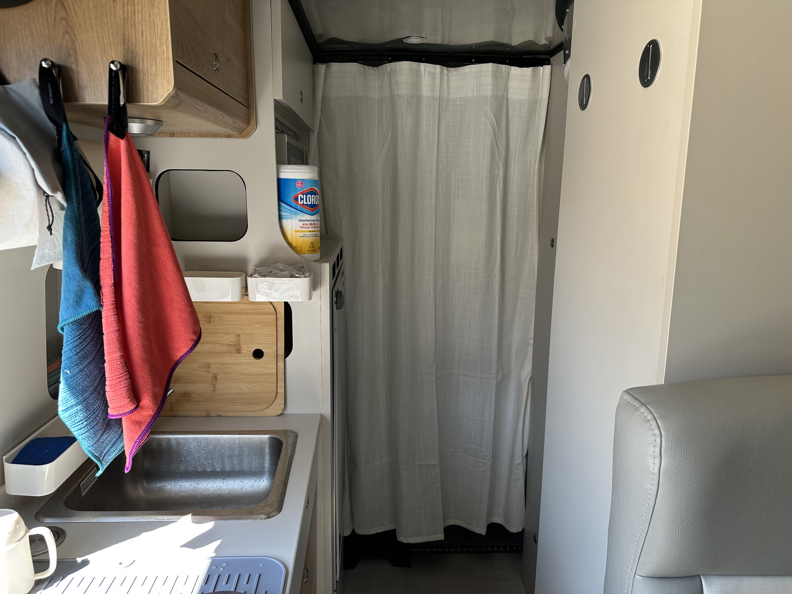
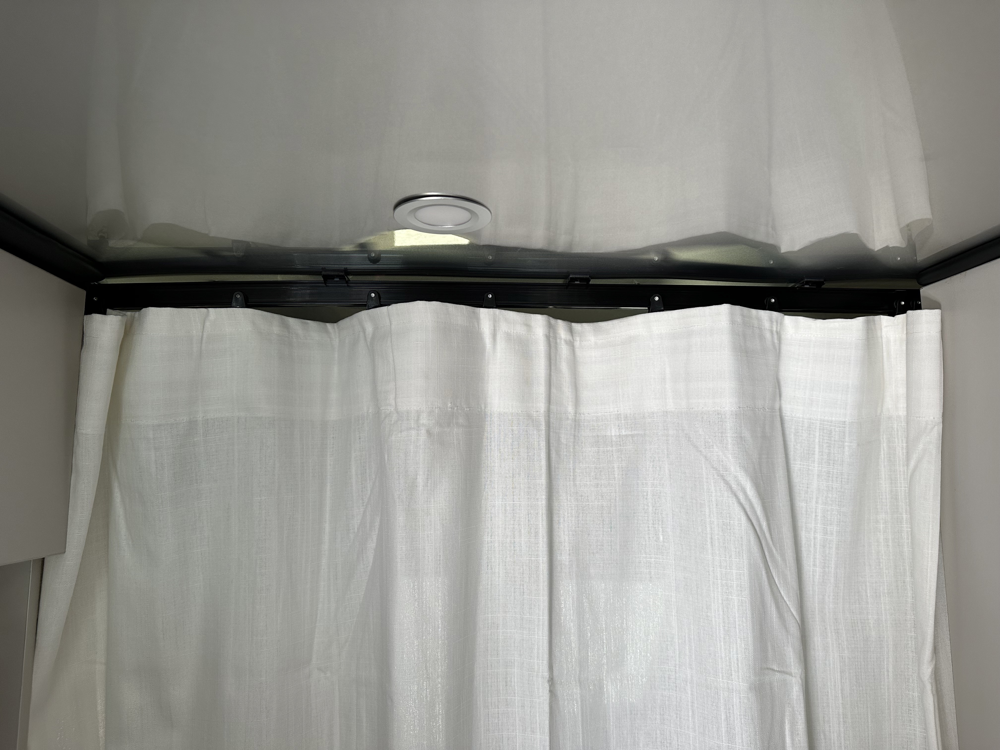

- I'm noticing that the [[inverter]] shuts off every so often and I can't get it to come back on. #problem
	- Watching [this Facebook post](https://www.facebook.com/groups/399267275508711/posts/564077725694331/) to see if replacing the 9-pin Soul SeeLevel module with a 7-pin module will fix it?
- Installed ((64a97c9e-5a48-4821-b0e0-1ba899fff20d)) and a [curtain](https://www.ikea.com/us/en/p/ritva-curtains-with-tie-backs-1-pair-white-00323514/) from [[IKEA]].
  id:: 64aaeb2e-56e1-47a3-a66d-743936675253
	- Considering installing the other one somewhere between the [[galley]] and the [[bath]] for a little changing area, but not sure about where to put the track.
	-  #photo
	-  #photo
- [Full size 4-piece mirror](https://www.amazon.com/dp/B0B58GQVLW/ref=nosim?tag=ffwf00-20) #equipment #upgrade
	- as per [this Facebook post](https://www.facebook.com/groups/399267275508711/posts/535294815239289/)
	- May have to purchase this one since it looks pretty good there.