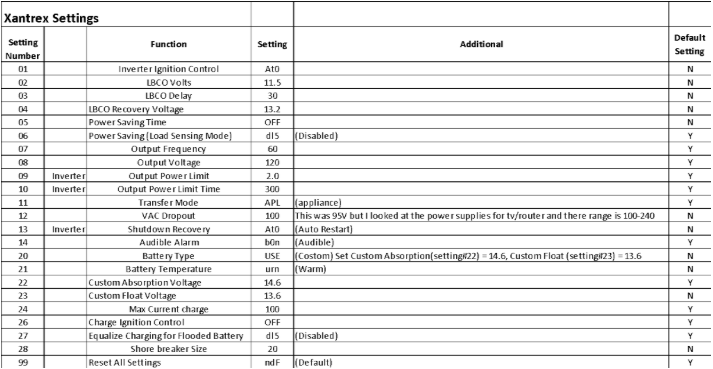

- [[Airstream/Bethany]] sent this guide to check the [[inverter]] settings #problem
	- 
	- 
	- All of my settings look correct but I can't seem to change/save them even if they weren't.
- I should note that I have a great pair of pliers-wrench that are the best I've ever used. They have come in handy working on the van. They're a bit pricey but function much better than other pliers. It's just a clever design.
	- [Knipex 8605180](https://www.amazon.com/dp/B01N3AE1HV/ref=nosim?tag=ffwf05-20) #equipment
- ((64a979ed-350a-406a-b63c-f0adcf78d064)) was delivered
- [[Airstream/Bethany]] says perhaps it's the SeeLevel Soul adapter and/or [[inverter]] firmware, dealer would need to fix.