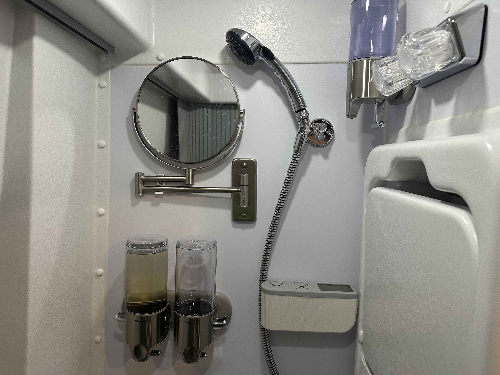
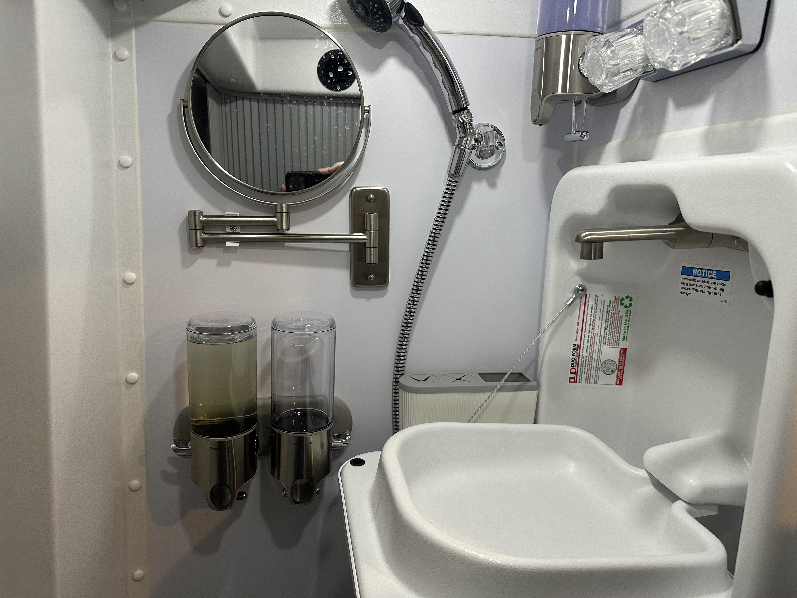
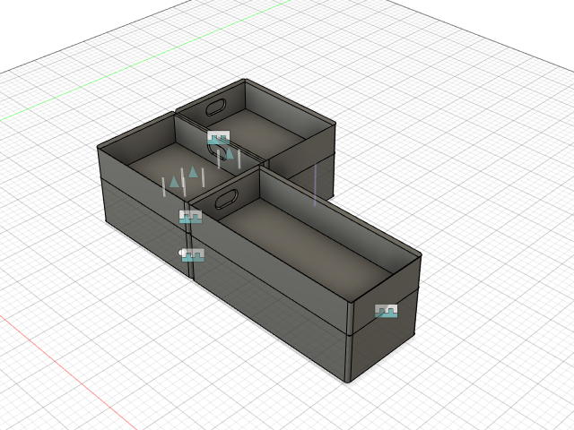

- Pictures of some gear installed in the [[bath]]
	-  #photo
	-  #photo
	- ((64a97c9d-a3de-4516-8849-6f4110968ea6))
		- Perfect spot right below the mirror (make sure the sink has enough clearance). Would have put them higher but my hand needs room to grab the mirror and pull it out. Also leaves room to hang small items from the mirror.
	- ((64a3070b-3f5c-4c03-89bd-7639817017fe))
		- Just fits between the sink and the wall. May not fit there in other vans, depending on how it was assembled.
	- ((64a979ee-52e0-463f-8f96-ab47100349d0))
		- Above and to the left of the [[bath/sink]]; contains liquid hand soap.
- 3D printing some drawer organizers for the drawer just below the [[galley/sink]] #storage
	- Using Autodesk Fusion 360 for the design.
	- 
- The ((64ae16dc-0ff9-48df-8518-b2613747187c)), ((64ae1704-0de8-4f9b-ac54-6b4a14c69147)), and ((64ae9aac-9901-4b8e-bca5-f3813e2e0109)) all arrived today.
	- I'm going to send back the ((64ae1704-0de8-4f9b-ac54-6b4a14c69147)) as it is too small to hold many gloves. It's more suitable to wear on a belt or backpack, and the straps aren't spaced properly for the panels on the back doors.